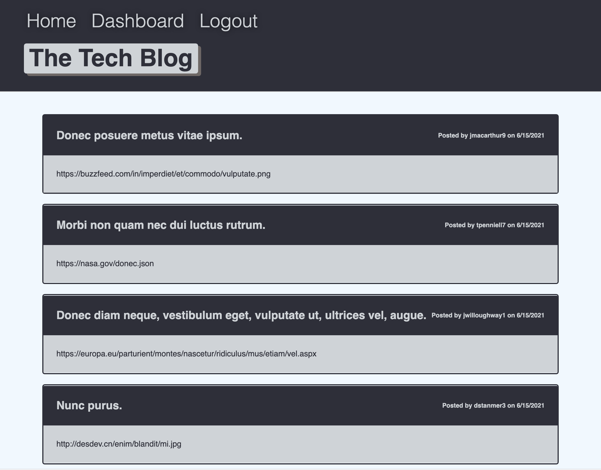
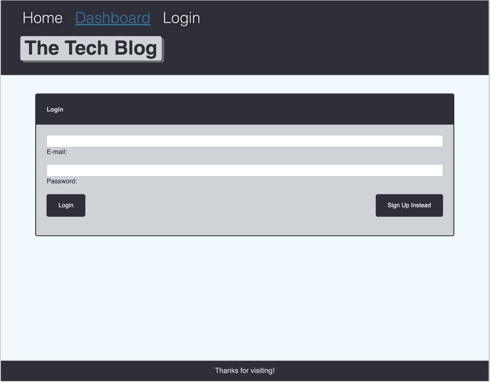
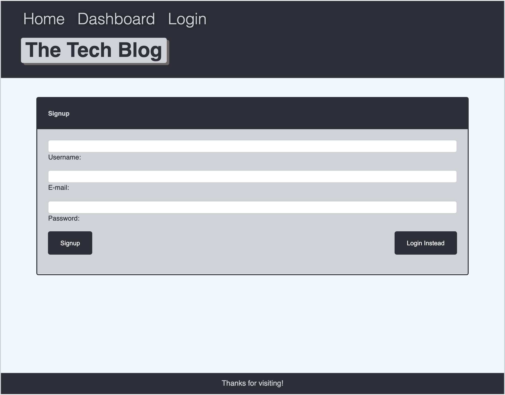
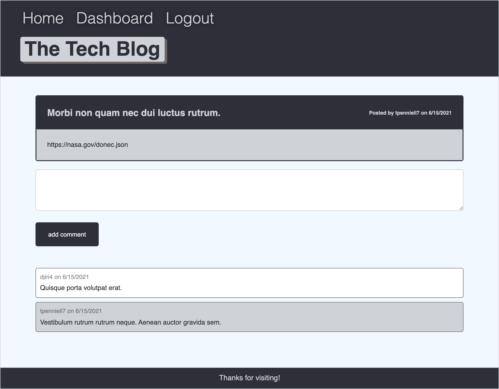
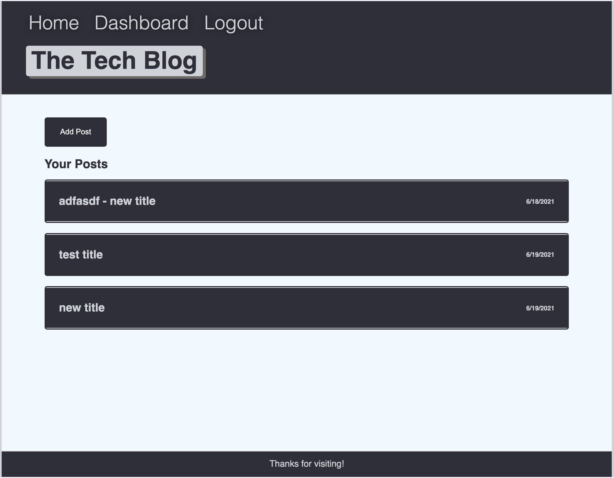
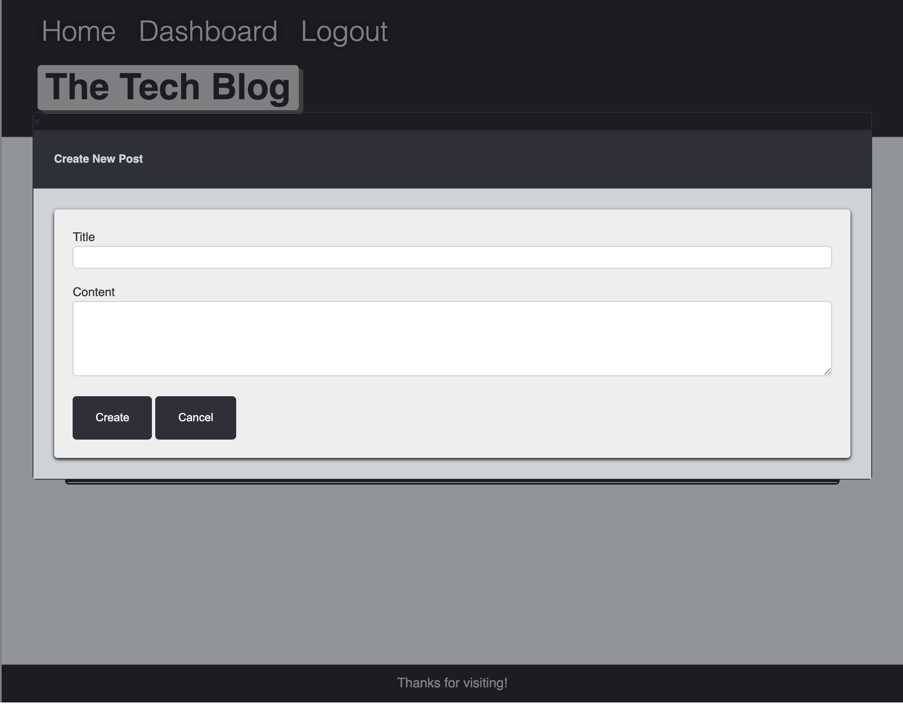
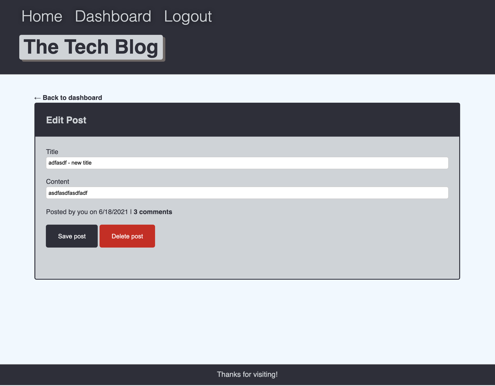

# tech-column

CMS-style blog site similar to a Wordpress site, where developers can publish their blog posts and comment on other developers’ posts as well.

# Installation

Clone the repositry from GitHub and open using Visual Studio Code.

# Usage

* Clone the repositry from GitHub and open using Visual Studio Code.
* run the command npm install to install dependencies
* Locally create .env file containing DB_NAME with database name, DB_USER with MySQL username (or 'root'), DB_PW with MySQL password and SECRET_SESSION. Run node seeds/index.js.   Then run node server (npm start).  Go to http://localhost:3001/ to see the app running on local.

* Displayed site - https://nameless-badlands-40198.herokuapp.com/
* Screenshots

  

# Technologies

* express js
* express-session
* Sequelize
* Handlebars
* dotenv
* mySQL2
* connect-session-sequelize

# Questions

[Contact me](chitra.iyer00@gmail.com)

[GitHub](https://github.com/ciyer87)
